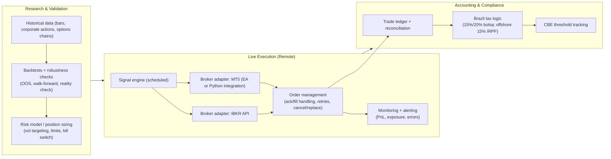
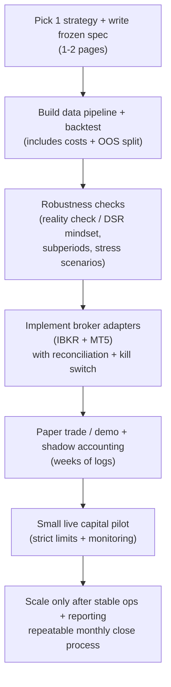

# Published “Proven Profitable” Trading Strategies: Evidence, Replicability, and Feasibility for Automated Execution from Brazil Using Interactive Brokers and an XP MetaTrader Account

## Executive summary

Publicly shared trading strategies fall into three very different “proof” tiers, and the tier determines what you can realistically replicate.

The strongest form of public proof—**audited, third‑party verified live performance plus full strategy disclosure (code/parameters/data)**—is **extremely rare**. This is not an accident: once a fully specified, capacity‑limited edge is public, competitors can arbitrage it away or crowd it, and returns often decay after publication. citeturn29search12turn29search2turn28search4

What *does* exist in abundance (and is plausibly the best match to your “replicable via code” constraint) are strategies whose profitability evidence is **reproducible from public data** and **robust across many markets and long horizons**—especially **trend/time‑series momentum**, **carry**, and broad **equity factor** families. These look less like “secret alphas” and more like **systematic risk premia** with long drawdowns and regime dependence. citeturn38search1turn37view1turn18search6turn34search1turn28search4turn29search12

On the practical side, **remote automated replication from Brazil is technically feasible** using (a) Interactive Brokers APIs for global markets and (b) MetaTrader automation (Expert Advisors/MQL5 or Python integration) for a MetaTrader‑enabled XP account—*but feasibility depends strongly on strategy frequency and microstructure sensitivity*. citeturn20search0turn20search22turn20search14turn16search2turn27search11turn26view0turn13view1

The core constraints you must engineer around are:

- **Taxes/reporting:** Brazilian rules differ materially for trading on Brazilian exchanges vs “aplicações financeiras no exterior” (which explicitly includes **derivatives**) and impose distinct declaration requirements (and, for many foreign‑sourced returns, annual taxation at **15%** under the post‑2023 offshore framework). citeturn12view0turn9view0turn10view2turn10view0  
- **Broker realities:** commissions, market data subscription costs, margin financing rates, and (for shorting) borrow availability/fees can dominate expected edge—especially for higher turnover strategies. citeturn21search12turn21search1turn21search2turn23view0  
- **Research risks:** backtest overfitting, selection bias, data‑snooping, and survivorship bias can make “published profitable” backtests fail out‑of‑sample unless you enforce rigor (e.g., reality checks, deflated Sharpe, strict out‑of‑sample). citeturn17search0turn17search2turn17search1turn17search3  

## What “proven profitable” means online and why fully replicable proofs are rare

A rigorous interpretation of “proven profitable” online typically requires at least one of the following evidence types:

A strategy can be considered **audited/verified** if it has **regulated performance disclosure** requirements (e.g., under U.S. commodity pool/CTA disclosure regimes) or third‑party verification of account statements—though most regulated disclosures still do **not** reveal full code and execution details. citeturn19search0turn19search1turn19search8

A strategy can be considered **reproducible** if an independent researcher can recreate key results from (i) **publicly available data**, and (ii) **a sufficiently complete algorithmic description** (signal rules, portfolio construction, rebalancing, leverage/vol targeting, transaction cost assumptions). This is the dominant “high‑credibility” tier for published academic strategies. citeturn38search1turn18search6turn18search0turn18search3turn35search0

A strategy can be considered only **anecdotally profitable** when evidence comes from forums, marketing pages, or backtests without robust controls. Even when a platform provides “verification” (e.g., via read‑only access credentials), the verification scope may be limited to confirming statement access rather than providing an audit of methodology, slippage, or survivorship. citeturn25search1turn19search3turn19search16

Two broad economic reasons explain why **fully specified profitable strategies rarely remain both public and profitable**:

- **Information and implementation are costly**, so markets cannot be perfectly informationally efficient in equilibrium; edges exist precisely because they require cost/risk/capacity to harvest. citeturn28search0turn28search4  
- **Publication and crowding effects:** many documented “anomalies” and predictors show **return decay after academic publication**, consistent with both arbitrage and data‑mining explanations. citeturn29search12turn29search2turn17search2  

This implies a realistic expectation for your goal: you are far more likely to replicate **robust, generic systematic strategies** (trend/carry/factors/options overwriting) than a “public secret” that is both fully disclosed and audited as a stand‑alone trading system.

## Candidate published strategies with the best combination of evidence and replicability

The table below prioritizes strategies that (i) have strong primary sources (peer‑reviewed papers, index methodology documents, regulator/broker documentation), and (ii) are implementable in code with realistic broker tooling.

### Comparison table of candidate published strategies

| Candidate strategy family | Source link (primary) | Evidence type (profitability proof) | Replication difficulty | Required infrastructure | Expected costs (dominant drivers) | Legal notes for Brazil (high level) |
|---|---|---|---|---|---|---|
| **Time‑Series Momentum / Trend Following (multi‑asset futures)** | “Time series momentum” (open‑access JFE version). citeturn38search0turn38search1 | Reproducible academic evidence across many liquid futures; long‑horizon robustness also documented in a century‑scale trend‑following study. citeturn38search1turn37view1 | **Medium** (signal simple; futures rolls/vol targeting care needed) | Daily/monthly data; futures roll logic; vol scaling; broker futures permissions; robust order management. citeturn38search1turn37view1turn20search0 | Commissions + exchange fees; market data subscriptions; margin financing; slippage around rolls. citeturn21search4turn21search12turn2search3 | Foreign futures/derivatives treated as “aplicações financeiras no exterior” for Brazilian residents under the offshore framework. citeturn9view0turn10view2 |
| **Asset‑Class Trend Following (10‑month SMA timing on ETFs)** | Faber TAA paper (SSRN PDF). citeturn35search0 | Reproducible rules‑based paper; implementation examples exist on quant platforms. citeturn35search0turn35search7 | **Low–Medium** (monthly rebalance is simple; data/ETF universe mapping is the main work) | Monthly EOM prices; robust calendar handling; rebalancing. citeturn35search0turn35search7 | Low turnover → costs dominated by data (if any) + commissions; optional VPS. citeturn21search12turn20search0turn27search8 | If implemented via foreign ETFs at Interactive Brokers, offshore taxation/reporting applies; if implemented via B3‑listed ETFs, Brazilian bolsa rules apply. citeturn10view2turn12view0 |
| **Carry (cross‑asset “futures carry” / term structure)** | “Carry” (JFE). citeturn18search6turn18search14 | Peer‑reviewed evidence that carry predicts returns across asset classes; reproducible with term structure data assumptions. citeturn18search6turn18search14 | **High** (data + contract selection + roll/curve measurement complexity) | Continuous futures curves or at least front/next; robust symbol mapping; careful cost modeling. citeturn18search6turn18search14turn21search4 | Data costs can be significant (term structure); futures commissions and roll slippage; margin. citeturn21search4turn21search12turn2search3 | Same offshore “aplicações financeiras” framing when executed abroad; derivatives explicitly included. citeturn10view2turn9view0 |
| **Cross‑Sectional Equity Momentum (winners minus losers)** | “Returns to Buying Winners and Selling Losers” (J Finance). citeturn18search0 | Classic peer‑reviewed anomaly evidence; replicable ranking/formation rules. citeturn18search0 | **Medium–High** (true long‑short requires reliable shorting + borrow) | Equity data; rebalancing; transaction cost model; borrow availability for shorts. citeturn18search0turn21search2 | Stock borrow fees + hard‑to‑borrow constraints; commissions; slippage at rebalance. citeturn21search2turn21search10turn21search12 | Shorting in Brazil generally requires securities lending (BTC) and collateral mechanics; B3 securities lending explicitly enables short‑selling. citeturn33search1turn33search4turn33search5 |
| **Equity Value / Size / Broad factor portfolios (Fama‑French style)** | Fama‑French factor papers + factor construction descriptions. citeturn34search0turn34search1turn34search10 | Foundational peer‑reviewed evidence; transparent factor construction in the data library (research returns). citeturn34search1turn34search10turn34search2 | **High** (portfolio formation requires fundamentals + reconstitution rules; investability constraints) | Fundamental data; survivorship‑free universe; reconstitution calendars; careful delisting handling. citeturn34search1turn17search3 | Data costs (fundamentals); turnover costs; potential borrow costs if long‑short. citeturn21search12turn21search2turn17search3 | Tax depends on where executed (B3 vs foreign). Brazilian bolsa trading has explicit 15%/20% rates by operation type. citeturn12view0 |
| **Pairs Trading (distance/mean‑reversion / cointegration variants)** | Gatev‑Goetzmann‑Rouwenhorst pairs trading paper. citeturn18search3turn18search11 | Peer‑reviewed evidence of historical profitability; requires careful accounting for microstructure and costs. citeturn18search3turn18search11 | **High** (execution/cost sensitivity; stable shorting) | High‑quality prices; robust spread modeling; borrow + portfolio netting; intraday monitoring if higher frequency. citeturn18search3turn21search2turn17search2 | Borrow fees; frequent trading costs; slippage; data; monitoring. citeturn21search2turn12view0 | In Brazil, “operate short” typically implies securities lending mechanics; B3’s lending service is designed to support short selling and requires collateral. citeturn33search1turn33search5 |
| **BuyWrite / Covered Call (e.g., BXM‑style monthly ATM call overwrite)** | entity["company","Cboe Global Markets","options exchange operator"] BuyWrite methodology (BXM). citeturn36view0 | Transparent rules‑based index methodology; explicitly defined as a *hypothetical* covered call strategy. citeturn36view0 | **Medium–High** (options execution + margin + exercise/settlement rules) | Options chain data; contract selection logic; roll calendar; robust risk limits; early exercise handling if using American options (or use European index options where available). citeturn36view0turn20search14 | Options commissions; spreads/slippage; margin interest; tail risk costs. citeturn21search0turn21search1turn20search14 | If implemented abroad, derivatives fall under offshore regime definitions; if implemented on B3 options, Brazilian bolsa tax rules apply for bolsa operations. citeturn10view2turn12view0 |
| **PutWrite / Short Put (cash‑secured put writing, monthly/weekly)** | PutWrite methodology. citeturn36view1 | Transparent, rules‑based index methodology; defined as writing puts plus holding T‑bill collateral (hypothetical strategy). citeturn36view1 | **High** (gap risk + margin + assignment; strategy is short convexity) | Robust margin simulation; option selection/roll rules; stress testing; kill switches. citeturn36view1turn21search1 | Options spreads; margin financing; severe drawdown risk; commissions. citeturn21search0turn21search1turn36view1 | Offshore derivatives included in “aplicações financeiras no exterior”; Brazilian reporting/tax applies accordingly. citeturn10view2turn9view0 |
| **Regulated managed futures / CTA programs (audited/regulated disclosure) — but not fully replicable** | entity["organization","National Futures Association","us derivatives sro"] CTA disclosure guidance + U.S. performance disclosure rule. citeturn19search0turn19search1 | Stronger “live performance disclosure” standards; still typically **no full strategy code** and limited replication detail. citeturn19search0turn19search1turn19search8 | **Very High** (because strategy details proprietary) | Not meaningfully replicable without insider detail; at best you approximate trend‑like behavior using public rules. citeturn19search0turn37view1 | Costs depend on the approximation you implement; replication of exact manager performance is unrealistic. citeturn19search0turn29search12 | If you *invest* via regulated products, compliance differs; if you *replicate* yourself, your Brazilian tax on trading applies. citeturn12view0 |

### Open-source and platform replication examples

Open-source code exists for several academic strategies, but typical caveats apply: most repos demonstrate backtests, not audited live execution.

- Time‑series momentum replication code examples exist on public repositories. citeturn3search0  
- Pairs trading replication code explicitly targeting the Gatev et al. framework exists publicly. citeturn30search0turn30search4  
- Strategy/backtesting engines and educational artifacts commonly referenced in the algotrading ecosystem include Zipline and the Lean engine. citeturn32search1turn32search3turn32search6  

As secondary (non‑primary) evidence, community discussions often emphasize that profitable strategies are rarely shared end‑to‑end, and that successful implementation is more about execution/robustness than copying a surface rule. citeturn19search3turn19search16  

## Legal and regulatory constraints for executing from Brazil via broker APIs and MetaTrader

### Brazil tax treatment for trading on Brazilian exchanges

For Brazilian exchange (“bolsa”) trading, entity["organization","Receita Federal do Brasil","brazil tax authority"] explicitly states the core income tax rates by operation type: **15% for operações comuns** and **20% for day trade**. citeturn12view0

The same official guidance also highlights that brokers withhold small “na fonte” amounts, which can be offset against monthly computed tax or annual adjustment, and that costs such as brokerage and exchange fees are relevant to computing net gain. citeturn12view0turn23view0

Implication: if you run an automated strategy on Brazilian markets (e.g., B3‑listed equities, ETFs, futures, options), you must engineer **post‑trade accounting** aligned with the “ganho líquido” model and distinguish day trade vs multi‑day trades at scale. citeturn12view0

### Brazil tax treatment for foreign trading via Interactive Brokers

Brazil’s post‑2023 offshore framework (entity["country","Brazil","federative republic"] law on rendimentos no exterior) requires Brazilian residents to declare foreign capital income separately in the annual return and subjects many foreign‑sourced “aplicações financeiras” returns to **15% IRPF** in the annual adjustment. citeturn9view0turn10view0turn10view2

Critically for systematic trading: the legal definition of “aplicações financeiras no exterior” explicitly includes “derivativos” among other financial instruments; thus futures/options trading abroad is squarely inside the offshore reporting/tax perimeter. citeturn10view2turn9view0

Operationally, the offshore instruction allows **loss offsetting** rules (within the defined category), which is important for strategies with frequent realized gains/losses. citeturn10view2turn10view0

### Central bank reporting for assets held abroad

Brazil also has a capital‑abroad declaration regime administered by entity["organization","Banco Central do Brasil","brazil central bank"] (CBE). Official guidance describes thresholds and obligations for declaring assets held abroad. citeturn1search3turn1search4

Practical implication: if your systematic strategy grows, you must treat **tax reporting + CBE** as a first‑class operational component (not a last‑minute spreadsheet), because automation increases trade count and reconciliation complexity. citeturn12view0turn10view2turn1search4

### Shorting and margin constraints in Brazil and abroad

For Brazilian equities, shorting normally relies on the centralized securities lending infrastructure operated by entity["organization","B3","brazil exchange operator"]: B3 describes securities lending as a service where the borrower may sell borrowed assets (“short‑selling”) and notes that B3 ensures the return of assets; B3’s FAQs also describe collateral requirements for borrowers. citeturn33search1turn33search5turn33search4

For Interactive Brokers, shorting cost is materially impacted by borrow fee dynamics and supply/demand; Interactive Brokers provides “Short Sale Cost” and short availability explanations, emphasizing that borrow rates can be elevated and vary. citeturn21search2turn21search10

Margin adds a second cost surface: Interactive Brokers publishes margin rates/financing information, and margin interest calculations can be material for levered systematic strategies (trend/carry/options). citeturn21search1turn21search17

### Broker availability and platform constraints

Interactive Brokers lists Brazil among account‑opening eligible jurisdictions, which supports feasibility of running the IBKR API stack from Brazil (subject to standard KYC and any product permissions). citeturn6view0

XP’s trading platform page positions MetaTrader 5 as a platform supporting creation of “robôs”/automation for trading strategies, aligning with your plan to implement algorithmic strategies in that environment. citeturn13view1

## Technical feasibility for remote replication using broker APIs, MetaTrader, and AI‑assisted implementation

### Broker API access and order management

Interactive Brokers supports multiple API surfaces for automation:

- **TWS API**: an interface to automate trading, request market data, and monitor account/portfolio; requires running Trader Workstation or IB Gateway. citeturn20search0turn20search9  
- **Client Portal API**: a RESTful API accessed over HTTP via a gateway process; intended as a “lighter weight” alternative to the local socket model. citeturn20search22turn20search4  
- Order types available through API are documented by Interactive Brokers and depend on the interface fields (TWS order object vs CPAPI endpoints). citeturn20search14turn20search1  

For XP MetaTrader, automation is typically implemented either:

- As **MQL5 Expert Advisors** (native “robot” scripting), or  
- Via **Python integration** through MetaTrader‑provided modules, which can send trading requests like `order_send` through the terminal to the broker’s trade server. citeturn16search2turn16search0  

MetaTrader’s own documentation notes that Python trading can be enabled/disabled via a platform setting (“Disable automatic trading via external Python API”), which is operationally important for safe deployments. citeturn27search11

### Data feeds and latency

Market data is often the single largest determinant of whether a “published strategy” is replicable in practice:

- Interactive Brokers offers market data pricing/subscription structures and API‑accessible data, but the exact subscriptions required depend on instruments (equities/options/futures) and exchanges. citeturn2search3turn20search8  
- MetaTrader virtual hosting is explicitly positioned as reducing latency to a broker’s trade server and enabling 24/7 operation of trading robots, which can matter for intraday strategies. citeturn26view0  

A sober engineering rule: **daily/monthly** strategies are typically robust to modest latency and occasional reconnects; **intraday** and especially **microstructure‑sensitive** strategies (pairs at high frequency, market making, latency arb) are far less replicable without co‑location and professional tooling—conditions not implied by typical retail broker setups. This is consistent with the heavy emphasis that backtesting engines put on modeling slippage/order delays rather than assuming frictionless fills. citeturn32search1turn32search5  

### Expected infrastructure architecture

### Cost model for “remote replication”

A realistic cost model should be treated as part of the strategy, because strategies with small theoretical edges can be overwhelmed by operational costs.

- **Cloud/VPS hosting:** you can host strategy services on commodity VMs (e.g., AWS Lightsail instance bundles starting at low monthly prices), or use provider offerings; pricing is published by providers and can change. citeturn27search8  
- **MetaTrader virtual hosting:** MetaTrader advertises in‑platform VPS/virtual hosting for 24/7 robot operation and low‑latency to broker servers (but you still need to evaluate region and practical reliability). citeturn26view0turn24search9  
- **Interactive Brokers costs:** commissions and fees vary by asset class and venue; margin financing and short borrow fees can be significant. citeturn21search12turn21search1turn21search2  
- **XP (Brazil) trading costs:** XP publishes detailed operational cost schedules including equity brokerage and futures (“minicontratos”) brokerage (including conditional “RLP” pricing and per‑contract fees), plus exchange fees and operational add‑ons. citeturn23view0  

## Risks that commonly break “published profitable” strategies in real trading

### Overfitting, selection bias, and data‑snooping

Backtest overfitting is not a theoretical nuisance; it is a predictable outcome when many strategy variants are tried. Formal methods quantify and warn about this (e.g., probability of backtest overfitting; deflated Sharpe concepts; and bootstrap “reality check” approaches). citeturn17search0turn17search1turn17search2

If you use “several AIs” to generate variants quickly, you are effectively increasing the search space—making **statistical correction and strong out‑of‑sample discipline** more important, not less. citeturn17search0turn17search2

### Survivorship bias and “backtestable” universes

Survivorship bias can materially distort performance studies if delisted/failed instruments drop out of the dataset; classic finance literature demonstrates how truncation can produce an appearance of predictability. citeturn17search3

For Brazil replication, the practical fix is: ensure your data/vendor and your symbol mapping handle delistings, corporate actions, and contract rolls correctly **before** trusting any performance estimate. citeturn17search3turn38search1

### Publication decay and crowding

Evidence suggests that some published return predictors/anomalies show post‑publication decay, consistent with both arbitrage and earlier overstatement (data mining). citeturn29search12turn17search2

Meanwhile, “limits of arbitrage” theory explains why mispricings can persist (risk/capital constraints), but also why copying can be unstable under stress—especially once a strategy becomes crowded. citeturn29search2turn28search10

### Transaction costs, slippage, and broker‑specific mechanics

Many public strategy writeups assume ideal execution (mid‑price fills, no partial fills, no order rejections). In practice, engines like Zipline explicitly highlight the need to model slippage, transaction costs, and order delays, because these are first‑order effects. citeturn32search1turn32search5

For shorting, borrow availability and borrow fee volatility can be decisive; Interactive Brokers documentation emphasizes that short borrowing costs can be elevated and depend on supply/demand. citeturn21search2turn21search10

For Brazilian shorting, securities lending requires collateral and operational workflows; B3’s documentation frames lending as the mechanism enabling short selling and notes collateral requirements. citeturn33search1turn33search5

## Recommended next steps and practical replication checklist from Brazil

### A “most replicable” short list to start with

If your primary goal is: **find something published + robust + realistically implementable with retail‑grade infra**, the best starting candidates are:

- **Time‑series momentum / trend following** on liquid futures or large ETFs (daily/monthly frequency). citeturn38search1turn37view1  
- **10‑month SMA asset‑class trend following** as a simpler, lower‑turnover variant you can implement and validate quickly. citeturn35search0turn35search7  
- **Options overwrite indices (BuyWrite/PutWrite)** only if you have strong risk controls, margin modeling, and are comfortable with tail risk and execution complexity. citeturn36view0turn36view1turn21search1  

Pairs trading and long‑short equity momentum can be excellent research exercises, but are often harder to replicate robustly in retail settings because costs/borrows and microstructure dominate. citeturn18search3turn21search2turn17search2

### Practical checklist

**Strategy selection and specification**
- Choose one strategy family and lock a “version 1” spec: signal rule, rebalance frequency, position sizing, leverage, and risk limits. Anchor to a primary published source (paper or index methodology). citeturn38search1turn35search0turn36view0turn36view1  
- Define what you will treat as “success”: e.g., risk‑adjusted return after costs, max drawdown, and stability across subperiods/regimes. Ensure you do not re‑optimize until you finish a full out‑of‑sample pass. citeturn17search0turn17search2turn17search1  

**Data and backtesting integrity**
- Use survivorship‑safe data where possible; explicitly test your pipeline for delistings/corporate actions (equities) and contract rolls (futures). citeturn17search3turn38search1  
- Add conservative transaction cost/slippage models; avoid assuming mid‑fills for strategies that trade at scale or in less liquid instruments. citeturn32search1turn32search5  
- Run at least one formal anti‑overfitting control (e.g., White reality check or an overfitting probability/deflated Sharpe style framework). citeturn17search2turn17search0turn17search1  

**Execution engineering**
- For Interactive Brokers, select either TWS API or Client Portal API and build a broker adapter with: idempotent order submission, reconnect logic, and strict position reconciliation. citeturn20search0turn20search22turn20search14  
- For MetaTrader, decide between an EA (MQL5) vs Python integration; confirm the platform setting posture for external Python trading and implement a hard kill switch. citeturn16search2turn27search11  
- Start with paper trading/simulation mode; keep logs of every decision, order state transition, and broker response for debugging. (IBKR and MetaTrader workflows are designed around explicit order/position state.) citeturn20search0turn16search2  

**Hosting and operations**
- Deploy to a stable remote environment (cloud VM or MetaTrader virtual hosting), and implement monitoring/alerts for: disconnected sessions, stuck orders, unexpected exposure, and daily PnL limits. citeturn26view0turn27search8  
- Treat market data subscription configuration as part of deployment; confirm that the live feed used for signals matches the feed used for execution/reconciliation. citeturn2search3turn20search8  

**Compliance and accounting from day one**
- Implement a trade ledger that supports Brazilian categorization: day trade vs operações comuns for B3 trading, and “aplicações financeiras no exterior” (including derivatives) for overseas trading. citeturn12view0turn10view2turn9view0  
- Track whether you cross any CBE reporting thresholds for assets abroad and prepare documentation trails. citeturn1search4turn1search3  

### A pragmatic implementation timeline

### Bottom-line answer to your core question

Yes—**people have published strategies on the internet with strong, reproducible evidence of historical profitability and sufficient algorithmic detail to replicate in code**, especially in the categories of trend/time‑series momentum, carry, broad factors, and rules‑based option overwriting. citeturn38search1turn37view1turn18search6turn34search1turn36view0turn36view1turn35search0

However, **strategies that are simultaneously (i) fully disclosed in code, (ii) demonstrated profitable via audited live statements, and (iii) still reliably profitable after becoming public are exceptionally uncommon**, and the literature on post‑publication decay and limits of arbitrage is consistent with why. citeturn29search12turn29search2turn28search4